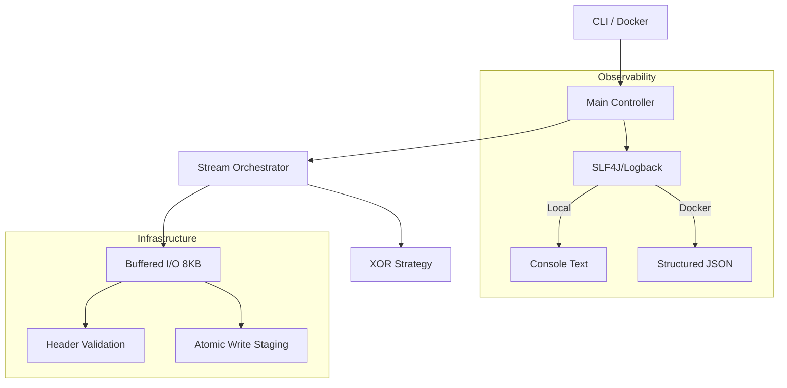

# CrypticCore Engine


CrypticCore is a high-performance Java-based encryption engine designed for memory-efficient file
transformation. It implements a decoupled architecture that separates the cryptographic logic
from the data streaming process.

---

## 1. Theoretical Foundation

### 1.1 The Transformation (XOR Logic)

The engine utilizes the bitwise **Exclusive OR (XOR)** operation. Given that XOR is an involution,
the transformation is self-inverse, allowing for identical encryption and decryption logic.

The operation is defined as:

$$P \oplus K = C$$
$$C \oplus K = P$$

### 1.2 Key Streaming (Modular Arithmetic)

To handle data streams where the length of the plaintext exceeds the key length, a cyclic key
schedule is implemented:

$$i_{key} = i_{file} \pmod{L_{key}}$$

## 2. Implementation Details

### 2.1 Java Type Handling (Sign Extension Mitigation)

To prevent unintended sign extension during the implicit promotion from `byte` to 32-bit `int`, a
bitmask of $0xFF$ is
applied to maintain 8-bit integrity:

$$Result = (P \land 0xFF) \oplus (K \land 0xFF)$$

### 2.2 Memory Efficiency & Performance

* **O(1) Space Complexity**: Processes data in discrete **8 KB buffers**, allowing files of
  arbitrary size (tested up to
  5 GB) to be processed with minimal RAM footprint.
* **Throughput**: Optimized for high-speed I/O, achieving over **400 MB/s** on standard hardware.
* **Real-time Telemetry**: Integrated progress bar and performance statistics (MB/s, latency).

### 2.3 Robustness & Safety

* **Atomic Writes**: Utilizes a `.tmp` file staging strategy. The final output is only created via
  an atomic `move`
  operation upon successful completion, preventing data corruption during crashes or power failures.
* **Memory Sanitation**: The encryption key is explicitly overwritten in the JVM heap using
  `Arrays.fill()` immediately
  after use to mitigate memory dump exploits.
* **Header Validation**: Strict magic number and version checking prevents the processing of
  incompatible or corrupted
  files.

### 2.4 SOLID Architecture & Decoupling

The engine is built on SOLID principles to ensure extensibility and testability:

* **Single Responsibility (SRP):** I/O handling, header validation, and cryptographic logic are
  strictly
  separated into specialized components (`HeaderHandler`, `FileValidator`, `EncryptionEngine`).
* **Dependency Inversion (DIP):** The engine does not depend on a specific UI. It communicates
  progress
  through a `ProgressObserver` interface, allowing for seamless integration into CLI, Web, or Cloud
  environments.
* **Interface Segregation:** Cryptographic strategies are injected via the `CipherAlgorithm`
  interface,
  making the engine open for future algorithms (e.g., AES) without modifying the core streaming
  logic.

## 3. Cloud-Native & Containerization

The engine is fully containerized to ensure environment parity and security.

* **Multi-Stage Docker Build:** Uses a builder stage (Maven) and a hardened runtime stage (JRE
  Alpine) to minimize image size (~160MB) and attack surface.
* **Security Hardening:** The container execution is restricted to a **Non-Root User**.
* **Orchestration:** Includes a `docker-compose.yml` for seamless integration into microservice
  environments.

---

## 4. File Format Specification

Every encrypted file starts with a 4-byte metadata header.

| Offset | Length  | Description        | Value (Hex / ASCII) |
|:-------|:--------|:-------------------|:--------------------|
| 0x00   | 3 Bytes | Magic Number (CCE) | `0x43 0x43 0x45`    |
| 0x03   | 1 Byte  | Format Version     | `0x01`              |

---

## 5. Usage

### 5.1 Native Execution

```bash
java -jar CrypticCore.jar <mode> <input> <output> <key>
```

### 5.2 Docker Execution

```bash
docker compose run --rm engine <mode> /app/data/input.txt /app/data/output.enc <key>
```

**Parameters:**

* **mode:** `ENCRYPTION` or `DECRYPTION` (Case-insensitive).
* **input:** Path to the source file.
* **output:** Final destination path for the transformed file.
* **key:** Secret key for transformation.

## 6. Quality Assurance

The project follows a rigorous testing strategy to ensure data integrity and system stability:

### 6.1 Automated Quality Gate (CI/CD) & Observability

The project utilizes **GitHub Actions** for continuous integration. Every push and pull request is
automatically validated against:

* **Compilation & Test Suite:** Ensures 100% build stability on Java 21.
* **Checkstyle (Google Java Style):** Strict enforcement of
  the [Google Java Style Guide](https://google.github.io/styleguide/javaguide.html).
* **Test Coverage (JaCoCo):** A quality gate is set to ensure a minimum of **85% code coverage**.
* **Hybrid Structured Logging:** Implements environment-aware logging. The engine automatically
  detects its environment and switches to Structured JSON Logging when running in Docker.

### 6.2 Testing Strategy

* **Unit Testing:** Verified the involution property and edge cases (byte boundaries).
* **Integration Testing:** End-to-end validation of the custom `.cce` format and header integrity.
* **Resilience:** Validation of atomic write operations and prevention of data truncation.
* **End-to-End Cycle:** Successful encryption and decryption of real file streams.
* **Atomic Integrity:** Verification of the `.tmp` staging and atomic move strategy.
* **Error Resilience:** * Detection of truncated files (Expected vs. Actual size check).
    * Prevention of in-place corruption (Same-file validation).
    * Robust header and version validation.

## 7. Project Architecture

The engine is structured into specialized packages to ensure high maintainability and separation of
concerns:

* **`at.tuwien.crypticcore.api`**: Functional interfaces and core contracts for algorithm
  strategies.
* **`at.tuwien.crypticcore.engine`**: The orchestration layer. Stateless execution of streaming
  cryptography.
* **`at.tuwien.crypticcore.io`**: Infrastructure layer handling format-specific headers (
  `HeaderHandler`), fail-fast validation (`FileValidator`), and the `ProgressObserver` pattern.

